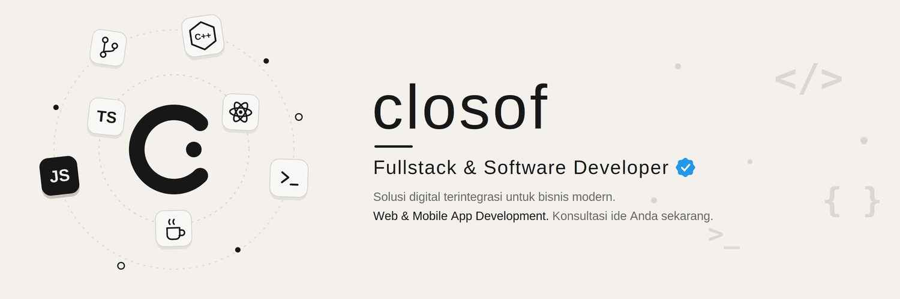

<h1>Hi 👋, I'm Closof Developer </h1>

### Full-Stack & Software Developer  

* Currently building **Web, App, and AI Projects**, from clean, user-friendly interfaces to reliable systems that solve real problems
* Continuously improving my skills in **React, Next.js, Laravel, Kotlin, .NET, and Cloud Technologies**, always learning new tools and best practices to write better, cleaner code
* More interested in **Backend Development**, especially building **APIs, databases, authentication systems, and scalable server-side applications** that stay fast, secure, and easy to maintain
* Skilled in leveraging **AI-powered development tools and coding agents**, including IDE agents such as **Antigravity and Codex**, as well as CLI agents like **OpenCode, Hermes, and OpenClaw**, to build faster without compromising quality
* **4 years of coding experience**, turning ideas into working software, from the first line of code to a finished product
* Recipient of the **Medallion for Excellence (MoE)** at **LKS National 2026** in **IT Software Solutions for Business**
* Open to discussing ideas, collaborations, and **Web & Mobile App Development** projects, feel free to reach out!

## Tech Stack

## GitHub Stats

  
  
  

## Connect with me

  

*"First, solve the problem. Then, write the code."*
